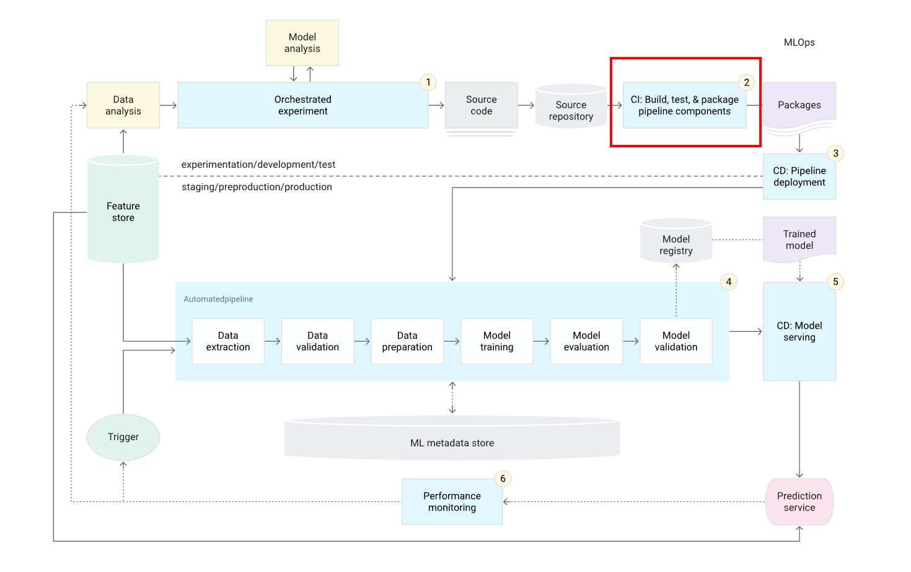
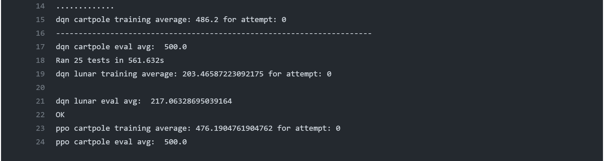
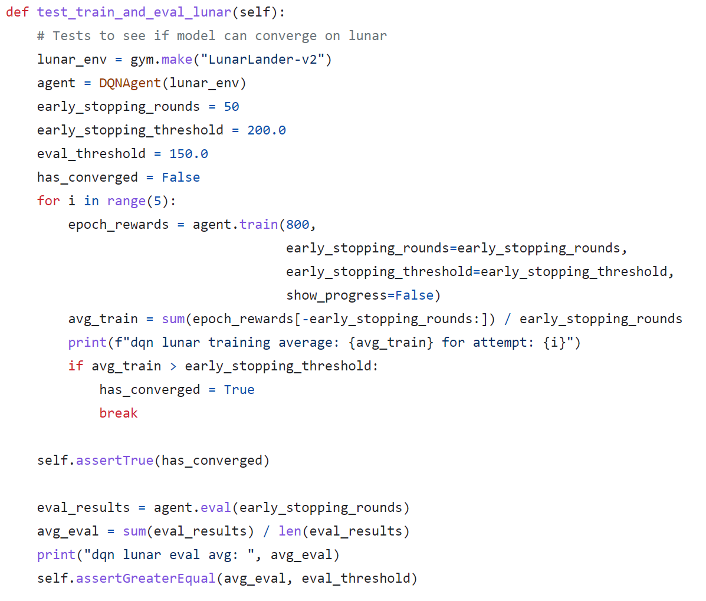

# TransformZero

By Scott Kinder

Usage:

`git clone https://github.com/kinderst/transformzero.git`

`cd transformzero`

`pip install -r requirements.txt`

To train:

`python -m scripts.trainer --env <env> --agent <agent> --epochs <epochs>`

To evaluate individual steps:

`python -m scripts.evaler_step --env <env> --agent <agent> --weights <path>`

To evaluate episode rewards:

`python -m scripts.evaler_episodes --env <env> --agent <agent> --weights <path> --episodes <episodes>`

Tests are run as:

`python -m unittest discover -s tests -p "test_*.py`

To estimate how long it will take to run, look at how long the tests took to run in Actions tab

## Deep Reinforcement Learning Continuous Integration

A major component of this package is the continuous integration via GitHub actions which allow for
us to assure with a degree of confidence algorithm convergence in known environments. This is important to 
confirm that the code for training models in new environments is the same code that worked in known environments, 
along with other tests to ensure that it should run properly in new environments (given proper setup for the 
new environment). It also demonstrates a proof of concept for Deep RL Algorithms and their models for MLOps.

To be specific, looking at the 
[Google MLOps Cloud Architecture page for MLOps level 2 (CI/CD pipeline automation)](https://cloud.google.com/architecture/mlops-continuous-delivery-and-automation-pipelines-in-machine-learning)
this proof of concept would cover the "CI: Build, test & package pipeline components" part, shown here:

For example, if we look at the Actions tab, and select a workflow:

and inspect the tests:

It shows that indeed the code for the agents does work for the environments that there are tests written for.

Additionally, if we look at an example test, say DQN on LunarLander-v2:

We see that both training is given 5 chances to converge (you can choose your statistical tolerance versus runtime)
and must have a decent eval score, again below the threshold due to statistical chance for failure (but not enough to
indicate that we should investigate necessarily). It depends on the environment and the tolerance for error,
and does not guarantee that the code is perfect nor optimized, only that it can converge on the environment.
However, this approach allows us to be more confident that the agents we are shipping work, and can provide proof
for users when they use this package that the models will converge (at least once) via the tests.

## Multimodality and Action Masks

Two often underlooked aspects that go into making a robust Deep RL agent includes being able to handle multimodal
input, as well as being able to mask out illegal actions.

First, on multimodality, this package contains the Multimodal Resnet and FC model class, which as the name suggests
handles image data with Resnet's and tabular data with fully connected layers. All it assumes is that the data
passed in is a dictionary, where each modality is an entry in the dictionary with tabular data having keys that
start with "flat", and image data keys that start with "img". From that it determines the proper shapes
and passes it through the multimodal architecture, and outputs the results from the modality into a modality
embedding dimension. Then the modality outputs are concatenated and fed through FC layers before outputting
to the desired output space, i.e. num_actions.

An example for a proof of concept of a (simple, small) working multimodal model as a DQN for Grid World is shown
in the tests as "multimodal gridnone". I assume it will work for gridone and gridtwo even though it is just a test
and therefore passes a bit of irrelevant data in this simple environment, but I haven't gotten around to testing
that yet.

On action masks, some small code adjustments are done for environments where utilizing a mask helps, such as
this formulation of Solitaire. This is because we don't want the agent to consider all possible actions when
determining Q-targets, instead only what actions would've been possible. Additionally, it just speeds up training
because there is no reason to learn Q-values for actions which aren't legal moves. So, we assume the environment
passes in the info (see Gymansium environment's "info" return from step) an action mask. From there, the agents
(only DQN for now) can handle environments where that mask is passed appropriately.

Right now the only environment where an action mask is practical is in the Solitaire environment, and to
train an agent for that difficult environment is too time consuming for a test, there is no test proof of concept
for mask, only the working set up which can be run from the trainer.py in scripts for proof.

## Using Transformers

Specifically, decoder-only transformer based on GPT-2 model, implemented by Andrej Karpathy in
[minGPT](https://github.com/karpathy/minGPT). However, for Reinforcement Learning, we are (usually)
working with other modalities of data besides language, and thus need to adapt the transformer
to handle tabular, image, or some other kind of data.

We also need to consider ways to encode state-actions pairs, as our output can be anything but how
we decide to structure the transition is still really an open question. Right now, I just either one-hot
encode the action and concatenate it with the state, or as a scalar value, or plan to add it as a plane to a state
image (i.e. either an image from a game in pixels, or perhaps a grid/board with each channel representing a class of
item in the game/environment)

The minGPT architecture is modified to handle tabular data by projecting the input data via a linear layer
into the original embedded dimension. For images, the idea will be the same, to have it handle the input
and cast it to the embedding dimension using convolutions to parse the input. This means we must now define
input dimension, and output dimension, instead of going from vocab-to-vocab dimensions.

Examples of how to train the minGPT-TimeSeries (minGPT-TS) model are in the tests, with proof to show they
converge given both dummy and real datasets, to create very accurate predictions (huber < ~0.001 for lunar lander
predicting the next state (8 dimensions) given the previous state and one-hot action (12 dim)).

The idea to apply this potentially to a Deep Q Network would be interesting, perhaps taking previous
states (i.e. 8-dim in Lunar), and outputting the Q-values (4 actions=4-dim) at the next time-step. 
This will be explored shortly, but unclear if it would be better than a traditional fully connected network.
Although you do get the advantage of the model seeing previous states, which may or may not impact the future,
if your Markov property is intact given your state representation. Sometimes we see this is not the case though,
for example in Atari even the researchers stacked previous states to keep a quasi-Markov property intact, but
by letting the model see as many steps back as you want (even to the beginning of the episode), we get the advantage
of having that information, and not having to encode it or stack it onto the input. For example, consider an environment
where an action you do early in the episode impact you a lot in the future. It would be cumbersome to create
variables to capture all of that information, instead it may be better to allow a model to see how those types
of transitions impact future rewards, similar to how GPT-2 predicts the next word based on all the words before it.

However, many simple environments with proper Markov encoding will only have the last state really be impactful, and
any learned relationships from previous states would just be a sort of collinearity, so it's questionable how useful
this is, especially in simple environments but maybe interesting in more complicated ones. Additionally, from
my testing in LunarLander, given 100 episodes with random transitions, this minGPT-TS achieves ~0.001 Huber, compared
to 0.03 MSE.

While I have not read too much in the literature about time series transformers, I theorize that it might be best to
train models to predict each individual dimension, making the output dim always 1. The input dim is still the same,
so we still get the same signal (as it was "encoded" "naturally" via it's time series n-dim data), and instead
can focus on optimization of loss over just that one dimension, instead of have our weights be trying to find a way to
predict all of them at once. This of course increases the computational cost, and would only be used in cases
where you have the resources. The trade-off is: create many models that would theoretically be more accurate on
each dimension (at each timestep of course), or create one model that predicts all the dimensions one once but
gets trained on more data. Again, it would probably come down to how expensive the simulator is, and to obtain new
data, versus train models. If our simulator is cheap, probably better to have 8x more data (assuming 8 dim like Lunar),
and train one big model. But if the simulator is expensive (or we desire highly accurate results, and we want to make
the most of our limited data, we train many models to just predict one dimension each. This is my theory, but it still
needs to be (empirically) tested.

## The Algorithm

Tree-based search, similar to [MuZero](https://arxiv.org/abs/1911.08265) with decoder-only GPT-2 time series 
transformer for models

The general idea for the algorithm is as follows:

1. Train a initial policy model exactly the same way it is done now (i.e.DQN, PPO)
2. Collect transition samples from the training process
   1. including initial obs/state, action, reward, terminated, next obs/state
3. Fit a time series transformer, taking the initial obs/state and action, and outputting the next obs/state time step
4. Once done, fine-tune a reward model and a terminated model
   1. takes obs/state and action, and outputs reward/terminated on transition

Once you have your DQN, Transition, Reward, and Terminated models, the algorithm for action selection goes as follows:

1. Initialize n threads, desired depth for threads, etc.
2. The Q-Values/PPO logits/policy model determine the proportion of threads to send each action branch, 
   1. with dirichlet noise for exploration
   2. PPO logits may be softmaxed, Q-Values may be shifted positive then divided by sum for probabilities, etc.
   3. Idea is to have initial best guess model guide our search during inference
3. The rewards are accumulated for each trajectory (from Reward model)
   1. also being multiplied by how likely the states before were terminal (from Terminal model)
4. Action is based on trajectory that had best reward

For training, Q-Value targets are found the same as always, and the rest of the models continue to add data to the 
buffer to improve the transition/reward/terminated models, which should help improve action search as training 
progresses.

Aside from obviously being inspired by MuZero and tree-based search, this idea also comes in part from 
the [original Deep Q Learning paper](https://arxiv.org/abs/1312.5602), where the authors stacked the previous 
4 frames to understand what direction things were moving. A time series transformer would also have 
access to that information, as well as how past transitions may influence future ones, even though we expect 
the transformer to really pay the most attention to the last few time steps.

Additionally, it seems like a good idea because for other models we may want to have such as one for 
a reward can be fine-tuned from the transition model, since the input is the same we are just trying to 
predict something different, hence we can simply just change the final linear output layer, and get the improvement
of having good initialized weights in the model. This should significantly reduce training time,
and improve results in general.