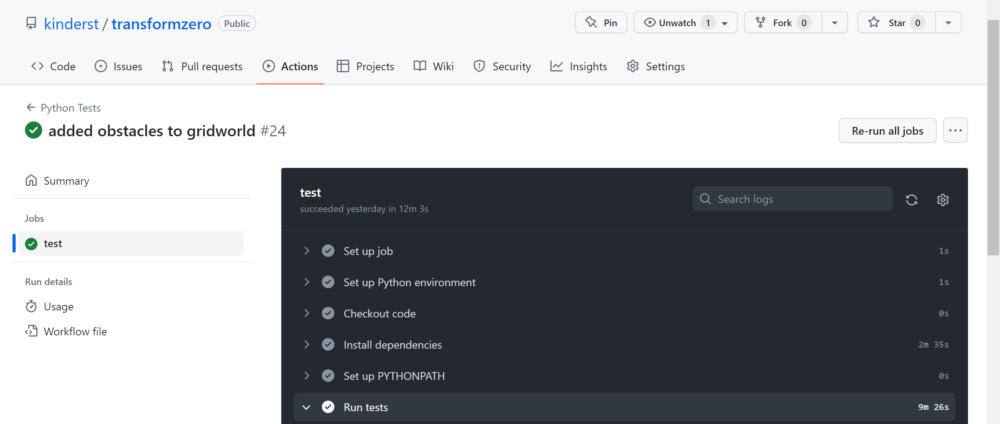

# TransformZero

By Scott Kinder

## Deep Reinforcement Learning Continuous Integration

A major component of this package is the continuous integration via GitHub actions which allow for
us to assure with a degree of confidence algorithm convergence in known environments. This is important to 
confirm that the code for training models in new environments is the same code that worked in known environments, 
along with other tests to ensure that it should run properly in new environments (given proper setup for the 
new environment). It also demonstrates a proof of concept for Deep RL Algorithms and their models for MLOps.

To be specific, looking at the Google MLOps Cloud Architecture page for MLOps level 2 (CI/CD pipeline automation)
this proof of concept would cover the "CI: Build, test & package pipeline components" part, shown here:

For example, if we look at the Actions tab, and select a workflow:

and inspect the tests:

It shows that indeed the code for the agents does work for the environments that there are tests written for.

Additionally, if we look at an example test, say DQN on LunarLander-v2:

We see that both training is given 5 chances to converge (you can choose your statistical tolerance versus runtime)
and must have a decent eval score, again below the threshold due to statistical chance for failure (but not enough to
indicate that we should investigate necessarily). It depends on the environment and the tolerance for error,
and does not guarantee that the code is perfect nor optimized, only that it can converge on the environment.
However, this approach allows us to be more confident that the agents we are shipping work, and can provide proof
for users when they use this package that the models will converge (at least once) via the tests.

## The Algorithm

Tree-based search, similar to MuZero with time series transformer as transition model

The general idea for the algorithm is as follows:

1. Train a DQN exactly the same way it is done now
2. Collect transition samples from the training process
   1. including initial obs/state, action, reward, terminated, next obs/state
3. Fit a time series transformer, taking the initial obs/state and action, and outputting the next obs/state time step
4. Once done, fine-tune a reward model and a terminated model
   1. takes obs/state and action, and outputs reward/terminated on transition

Once you have your DQN, Transition, Reward, and Terminated models, the algorithm for action selection goes as follows:

1. Initialize n threads, desired depth for threads, etc.
2. The Q-Values determine the proportion of threads to send each action branch, with dirichlet noise for exploration
3. The rewards are accumulated for each trajectory (from Reward model)
   1. also being multiplied by how likely the states before were terminal (from Terminal model)
4. Action is based on trajectory that had best reward

For training, Q-Value targets are found the same as always, and the rest of the models continue to add data to the 
buffer to improve the transition/reward/terminated models, which should help improve action search as training 
progresses.

Aside from obviously being inspired by MuZero and tree-based search, this idea also comes in part from 
the [original Deep Q Learning paper](https://arxiv.org/abs/1312.5602), where the authors stacked the previous 
4 frames to understand what direction things were moving. A time series transformer would also have 
access to that information, as well as how past transitions may influence future ones, even though we expect 
the transformer to really pay the most attention to the last few time steps.

Additionally, it seems like a good idea because for other models we may want to have such as one for 
a reward can be fine-tuned from the transition model, since the input is the same we are just trying to 
predict something different, hence we can simply just change the final linear output layer, and get the improvement
of having good initialized weights in the model. This should significantly reduce training time,
and improve results in general.